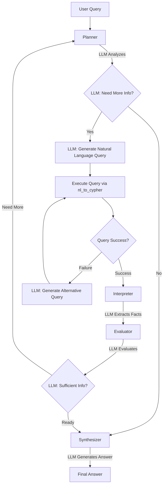

# Adaptive Query System - Complete Flow Analysis & Reasoning
## 📋 How The System SHOULD Flow (Fully Agentic)



## 🔄 Detailed Node Responsibilities & Reasoning

### 1. **PLANNER NODE** ✅ (Mostly Agentic)
**Current State:** Good - Uses LLM with structured output
```python
# GOOD: LLM-driven planning
structured_llm = llm.with_structured_output(PlannedQueryWithGaps)
```
**Reasoning:** 
- LLM understands query intent from natural language
- Identifies gaps based on schema understanding
- No hardcoded query patterns

**Still Needs Fix:**
- Remove hardcoded schema reference
- Remove display truncation limits ([:10], [:5])

### 2. **EXECUTOR NODE** ✅ (Properly Agentic)
**Current State:** Good - Delegates to nl_to_cypher
```python
# GOOD: No arbitrary logic
result = query_graph_with_natural_language(query_text)
```
**Reasoning:** Execution is purely functional, no decisions made

### 3. **INTERPRETER NODE** ⚠️ (Partially Arbitrary)
**Current State:** Mixed - Fact extraction has arbitrary patterns
```python
# BAD: Arbitrary entity type inference
if len(value) < 50:  # ❌ WHY 50?
    return "identifier"
```
**Fix Needed:** LLM should interpret what facts mean, not pattern matching

### 4. **EVALUATOR NODE** ✅ (Recently Fixed)
**Current State:** Good - Now uses LLM evaluation
```python
# GOOD: LLM-based semantic evaluation
class ProgressEvaluation(BaseModel):
    phase: Literal["exploring", "refining", "completing", "ready"]
    has_sufficient_information: bool
    reasoning: str
```
**Reasoning:** LLM understands semantic completeness, not numeric thresholds

**Still Needs Fix:**
- Remove hardcoded termination conditions (max_iterations, time_limit)
- Let LLM decide if too many failures warrant stopping

### 5. **SYNTHESIZER NODE** ❌ (MOST PROBLEMATIC)
**Current State:** Bad - Full of arbitrary logic
```python
# BAD: Hardcoded query type determination
if "list" in query_lower:  # ❌ ARBITRARY!
    answer = _synthesize_listing(state)

# BAD: Arbitrary formatting
if value > 1000000:  # ❌ WHY THIS THRESHOLD?
    parts.append(f"{value/1000000:.2f}M")
```

**Complete Fix Needed:**
```python
class SynthesisStrategy(BaseModel):
    """LLM determines how to synthesize answer"""
    format_type: str  # LLM decides: table, list, narrative, etc.
    key_facts_to_include: List[str]
    formatting_instructions: str

# LLM generates entire answer
def synthesizer_node(state):
    strategy = llm.with_structured_output(SynthesisStrategy).invoke(...)
    answer = llm.invoke(f"Generate answer using: {strategy}")
```

## 🎯 Required Fixes for Full Agency

### Priority 1: Remove ALL Arbitrary Query Classification
```python
# REPLACE THIS:
def _determine_query_type(query: str) -> str:
    if "list" in query_lower:  # ❌ DELETE
        return "listing"

# WITH THIS:
class QueryIntent(BaseModel):
    intent_type: str
    format_preference: str
    
def classify_query_intent(query: str) -> QueryIntent:
    return llm.with_structured_output(QueryIntent).invoke(query)
```

### Priority 2: Dynamic Termination
```python
# REPLACE THIS:
if state.consecutive_failures >= 3:  # ❌ DELETE
    stop = True

# WITH THIS:
class ContinuationDecision(BaseModel):
    should_continue: bool
    reasoning: str
    
def should_continue_querying(state) -> ContinuationDecision:
    return llm.with_structured_output(ContinuationDecision).invoke(state_context)
```

### Priority 3: Remove ALL Display Limits
```python
# REPLACE ALL:
entities[:10]  # ❌ DELETE
facts[:5]      # ❌ DELETE

# WITH:
# Let LLM decide what's important to show
important_facts = llm.invoke("Select key facts to display from: {all_facts}")
```

### Priority 4: LLM-Driven Synthesis
```python
# COMPLETE REWRITE NEEDED
def synthesizer_node(state):
    # No query type determination
    # No arbitrary formatting
    # Pure LLM generation
    prompt = f"""
    Generate answer for: {state.original_query}
    Using facts: {state.discovered_facts}
    Format naturally based on query intent.
    """
    return llm.invoke(prompt)
```

## 🔍 Validation: Is Each Decision LLM-Driven?

| Component | Current State | Should Be | Action Required |
|-----------|--------------|-----------|-----------------|
| Query Planning | ✅ LLM | ✅ LLM | Minor cleanup |
| Gap Identification | ✅ LLM | ✅ LLM | Good |
| Query Execution | ✅ Functional | ✅ Functional | Good |
| Fact Interpretation | ⚠️ Pattern matching | ❌ LLM | Needs LLM interpretation |
| Progress Evaluation | ✅ LLM | ✅ LLM | Good (just fixed) |
| Termination Decision | ❌ Hardcoded | ❌ LLM | Critical fix needed |
| Query Classification | ❌ Keywords | ❌ LLM | Critical fix needed |
| Answer Synthesis | ❌ Templates | ❌ LLM | Complete rewrite |
| Display Formatting | ❌ Arbitrary | ❌ LLM | Needs LLM selection |

## 📊 Domain-Agnostic Scorecard

### Current Score: 4/10 ❌
- ❌ Hardcoded schema
- ❌ Query type classification  
- ❌ Arbitrary thresholds
- ❌ Fixed formatting rules
- ✅ LLM planning
- ✅ LLM evaluation
- ✅ Generic state management
- ✅ Schema-aware gaps

### Target Score: 10/10 ✅
Every decision should be:
1. **Semantic** - Based on meaning, not patterns
2. **Contextual** - Considers discovered facts
3. **Adaptive** - Adjusts to any domain
4. **Explainable** - LLM provides reasoning

## 🚀 Implementation Priority

1. **IMMEDIATE** - Fix query type classification (biggest violation)
2. **HIGH** - Remove hardcoded schema
3. **HIGH** - LLM-driven termination
4. **MEDIUM** - Rewrite synthesis functions  
5. **LOW** - Remove display truncation

## Conclusion

The system has good bones (LangGraph structure, LLM planning) but is contaminated with arbitrary logic that breaks domain-agnostic design. The synthesis functions are the worst offenders, making assumptions about how to format financial data. Every `if "keyword" in query` and every magic number must be eliminated for true agency.